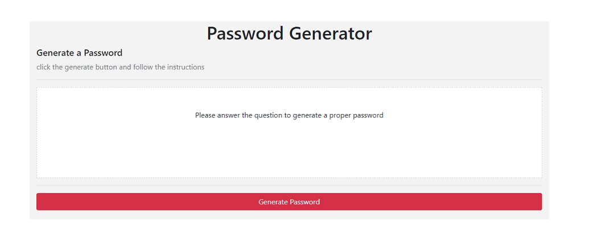

# Password Generator

this is a readme file expalining the step to take in order to generate a password

click the generate password button to start the process

first the user will be asked to enter a number between 8 and 128 which represents the length of desired password

then the user will confirm which types or characater he/she would like to use in hte password
the criteria's are:
* Lower Case letters,
* Uppercase letters,
* Numbers,
* Special characters

["generate password"](https://laithalwani.github.io/password-generator).

This website uses an MIT license.